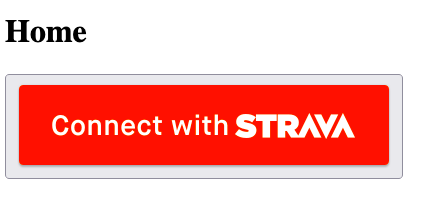
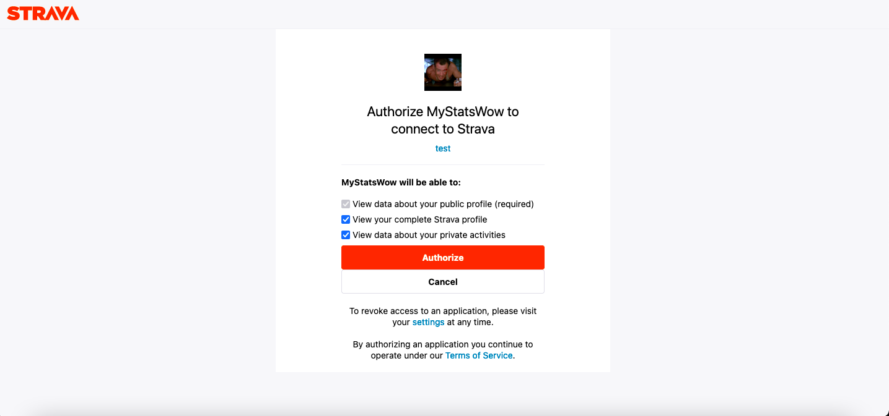
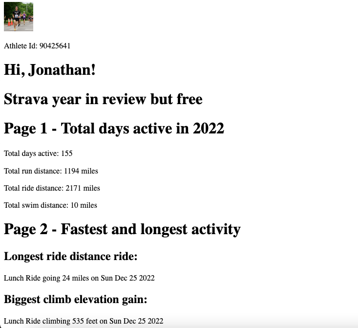

# strava-year-recap-but-free

This is against their API TOS

Strava year in review has:
- 2 useless panels
- total days active showing top sports
- total days active (with %)
- fastest activities, longest activities
- how many kudos given and received, local legends segments and segment records
- total elevation and total distance
- top photos of the year
- 2022 totals

## Idea
- don't need to replicate Strava year in review
- one/two panels with adjacent level content is fine

## Todo
- ✔️ get Oauth website example
- ✔️ output (basic) data on frontend
- [ ] finish parsing/analytics to get the stats needed
- [ ] make basic ui elements to mimic it
- [ ] mock up page designs
- [ ] find a way to screenshot the data and save as an image
- [ ] figure out hosting and a domain
- [ ] cache results in a database so we don't do the call every time

Resources:
- https://www.grace-dev.com/python-apis/strava-api/
- https://github.com/dunleavyjack/Strava-OAuth2-Test

## Running Locally

**WARNING:** THIS DOES NOT CURRENTLY USE ALL ACTIVITIES. It gives incomplete year in review stats. I capped it at a certain amount so I don't get rate limited by Strava's API. If you want to risk it all and test a much slower version go to StravaRedirect.js and change `const pagination_amount = 5` to `200`. Beware the app may not work if you do this, it will DEFINITELY run much slower, and may even use too many API calls trying to run the app.

1. Run `npm install` in the react directory to install deps

2. Run `npm start` to start the server at localhost:3000

3. Go to `localhost:3000` and click "Connect with Strava"

4. Login with Strava (authorize all the data)

5. If it loads correctly the stats should be in the redirect link of localhost:3000/yourdistance

# Other ideas:
- top 5 kudos buddies (top 5 people who gave you the most kudos)
- some myers-briggs thing with bike archetype or something
- zones data
- when you like to do activities (morning, midday, evening, night)

group v solo

runner
triathlete
night biker

website or email the result?
